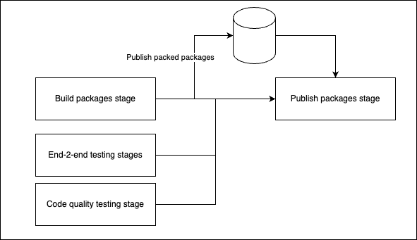

# Gitbump

Gitbump is a complete customizable git-based release management system. Primarily focused on package releases.


## Key concepts

- [Branch based release strategy](#branch-based-release-strategy)
- [Tag based versioning (no versions in files)](#tag-based-versioning)
- [Conventional commit based bumps](#conventional-commit-based-bumps)
- [Native monorepo support](#native-monorepo-support)
- [Split stage publish](#split-stage-publish)
- Plugin based customization

## How does it work

### Branch based release strategy

The core concept of gitbump evolves around branch detection and branch types.

Gitbump defines the following types:
- main/master branch (default branch name **'main'**)
- release branches (default matches **'release/*'**)
- feature branches (default matches **'feature/*'**)

The names and detections can be customized to your own need.

Depending on the detected branch types the system will make different choices:

| Branch           | Branch type | Version namings | (NPM) Release tag | Changelog | Notes                                                                |
| :--------------- | :---------- | :-------------: | :---------------: | -- | :------------------------------------------------------------------- |
| main             | main        | 1.0.0           | latest            | yes |Official releases                                                    |
| release/next     | release     | 1.0.0&#8209;next.0    | next              | yes | (Pre) releases                                                       |
| feature/gh&#8209;1234  | feature     | 1.0.0&#8209;gh&#8209;1234.0 | gh&#8209;1234 (*) | no | Feature release. I.e. to let the customer test the requested feature |

> You can chose if and how feature releases are released. This can differ from release branches. 

### Tag based versioning

Like most release systems gitbump will add a tag for each release. This will follow the tag naming with a prefix (default 'v'). I.e.

- v1.0.0
- v1.2.3-next.0

The difference of gitbump is that the tags are the only source of truth. It does not care about versions inside files and will keep them even on the default "0.0.0".

There are two main advantages of this strategy:

- One source of truth. Easy to see in git history what the current state is
- No more merge conflicts due to mismatches of versions. Otherwise this will happen constantly with feature/release strategies

Gitbump has 2 commands to work with this git-only version strategy:

#### Restore 
```bash
yarn gitbump restore
```

The output will be something like:


As you see with this you wil get all versions back in package.json files.

#### Reset 
```bash
yarn gitbump reset
```

The output will be something like:


As you see with this you wil reset all versions back to '0.0.0'.

### Conventional commit based bumps

Gitbump works with the concept of a "bump". This is one of the key commands:

```bash
yarn gitbump bump
```

Bump will do the following steps:

- [Restore](#restore) the current status from git
- Read the git history and search for [Conventional commit](https://www.conventionalcommits.org/en/v1.0.0/) style messages
- Define a bump type based on the outcome
- Update the workspaces with the new version
- Udate the workspaces with the workspace specific changelogs
- Create a bump manifest in the **gitbump.out** folder containing versions and changelogs

### Native monorepo support

Gitbump is build for monorepos with multiple workspaces. It will detect all (public) workspaces and use them during bump.

There are 2 main operation modes:
- [global versioning](#Global-versioning)
- [independent versioning](#Independent-versioning)

#### Global versioning

This is the default mode. This will keep all versions of all workspaces the same. This is useful for monorepos with series of packages (i.e. ***'@aws-sdk/*'***)

#### Independent versioning

This will use unique versions per workspace in the mono repo. Based on the path of the committed files it will decide if the specific workspace needs a bump and which bump type.

### Split stage publish

Gitbump is buld for usage within CI/CD pipelines. When building packages gitbump can be used in a pipeline like this:



This will allow you to run your time consuming steps in parallel with your build step. Only when all checks pass you have a (quick) publish stage.
